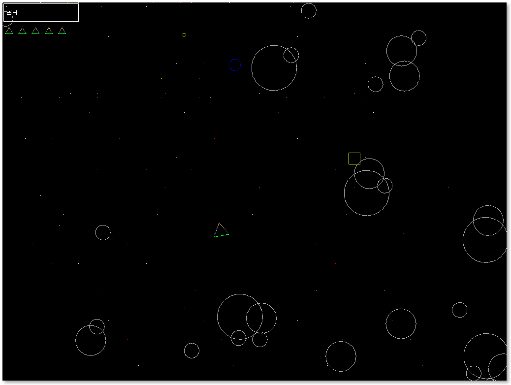

# Игра "Астероиды"

## Геймплей

Ваша цель - набрать максимальное количество очков, управляя космическим кораблём - разноцветным треугольником. Очки начисляются за попадания по астероидам (белые круги) и прохождение уровней. Чтобы пройти уровень, нужно уничтожить определённое количество астероидов, чем выше уровень - тем больше придётся уничтожить астероидов и тем больше награда! Попадание в группу астероидов разобьёт её на две меньшие группы, а попадание в одиночный астероид уничтожит его. Если же корабль столкнётся с астероидом, вы теряете одну жизнь, корабль становится неуязвимым на короткое время, а по астероиду засчитывается попадание(правда, очки за такой способ зачистки астероидов не начисляются). Кроме того, время от времени будут появляться бонусы - они выглядят как цветные геометрические фигуры: красный треугольник добавляет одну жизнь, жёлтый квадрат временно улучшает ваше оружие, а синий круг делает вас неуязвимым на некоторое время.

## Управление

* Вверх - ускорение
* Влево - разворот против часовой стрелки
* Вправо - разворот по часовой стрелке
* Пробел - стрельба
* Эскейп - выход из игры
* Enter - показать счётик FPS(верхний правый угол)

##  Интерфейс

В левом верхнем углу показано число, отображающее текущее количество очков. Чуть ниже расположен счётчик здоровья - у вас столько жизней, сколько там показано копий корабля.

